# How to deploy your Flask app to Azure (with example)

This tutorial will show you, how to deploy your Flask app to Azure App Service.

## What is Azure App Service?

It's a hosting provider (cloud) by Microsoft, similar to Google's App Engine.

## Deployment steps

### Prepare your Flask app

First create a your Flask project on your computer (if you haven't yet).

You can copy the code from this repository. At minimum, the Flask project needs to have:

- **One Python file:** ours is called main.py. See the code that it contains.
- **The requirements.txt file:** This file contains the list of Python (PIP) libraries that the project depends on. In 
our case it depends on Flask.

### Push to GitHub

Create a repository on your GitHub account and push this code to it. We will use GitHub to deploy the project to Azure later.

### Create an account on Azure

Go to this URL: [https://azure.microsoft.com/en-us/free/](https://azure.microsoft.com/en-us/free/) and create a free 
Microsoft Azure account for yourself.

You will also be asked to provide your credit card info, but this is only to verify your identity and an anti-spam 
measure. Your credit card will not be charged as long as you use the free Azure services (as we'll do in our tutorial).

### Create an App Service

Once you have your Azure account ready, you can log into the Azure dashboard and create your first App Service. This is 
similar to a GAE project on Google Cloud.

**Step 1:**

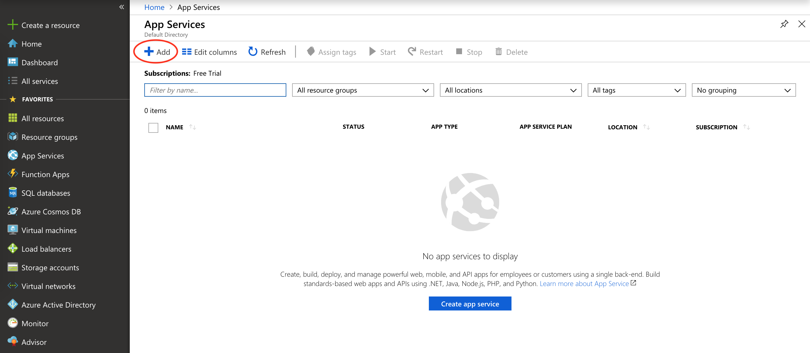

**Step 2:**

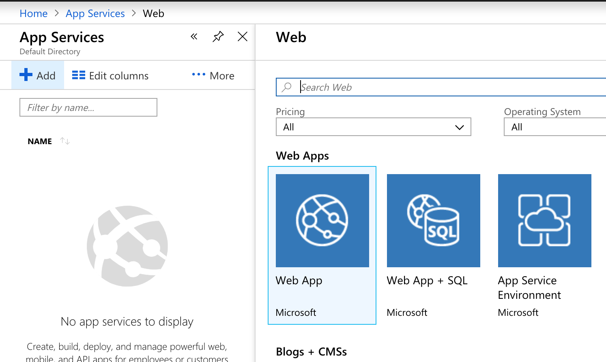

**Step 3:**

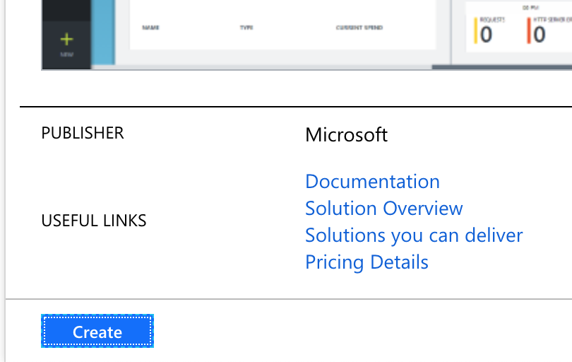

**Step 4:**

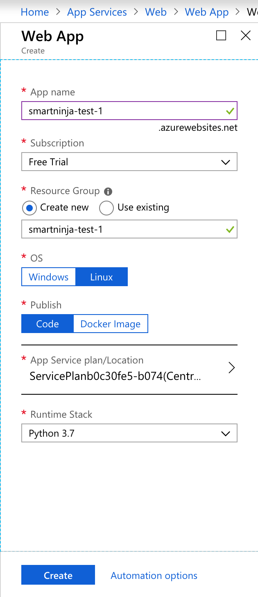

### Wait for the App Service to be created

Wait a minute or two that Azure creates a new App Service project for you. You can see the progress in the upper right 
corner (click on the bell icon):

**In progress:**

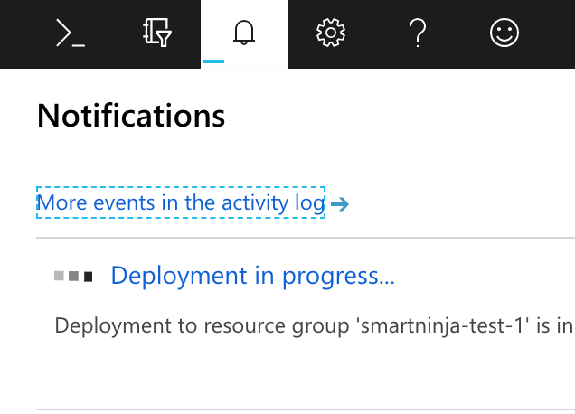

**Success:**

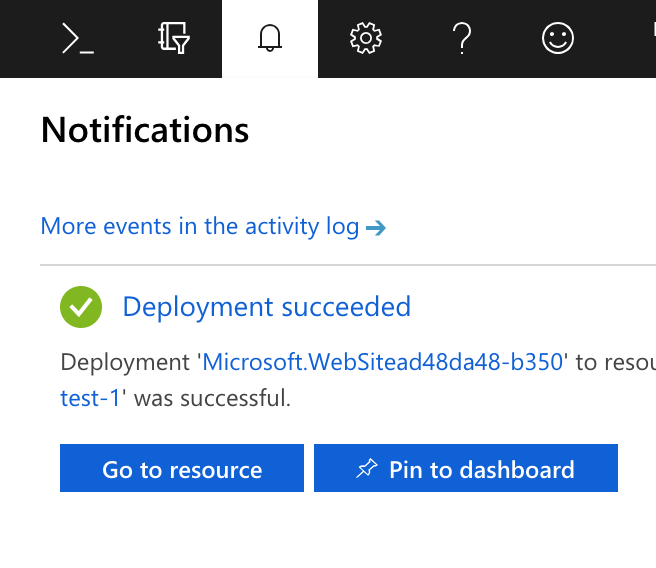

Click on **Go to resource** now.

### App Services list

Go to the App Services tab, where you can see your new web app listed (click on it):

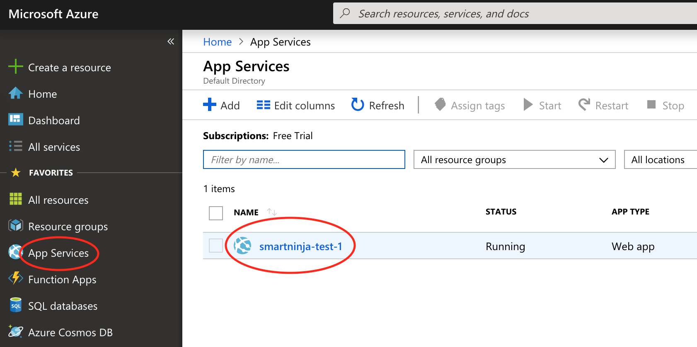

Click on the URL for your new website:

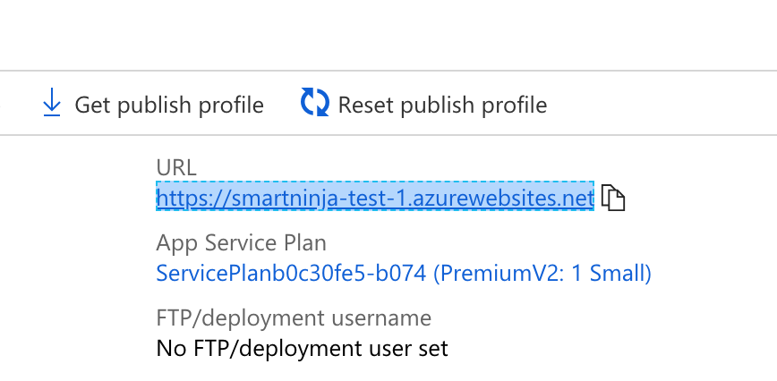

This will open a new tab in your browser and show you your web app:

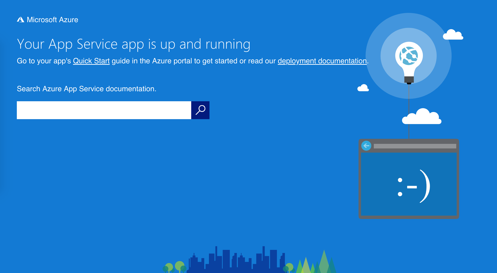

Right now there's some text by Microsoft on it, but your Flask app is not there yet. Let's get it deployed on Azure.

### Connect your GitHub account to Azure

In order to deploy your Flask app on Azure, you'll need to connect your GitHub account to it. Go to **Deployment Center** 
tab and follow these steps:

**Step 1:** Click on GitHub and authorize your GitHub account.

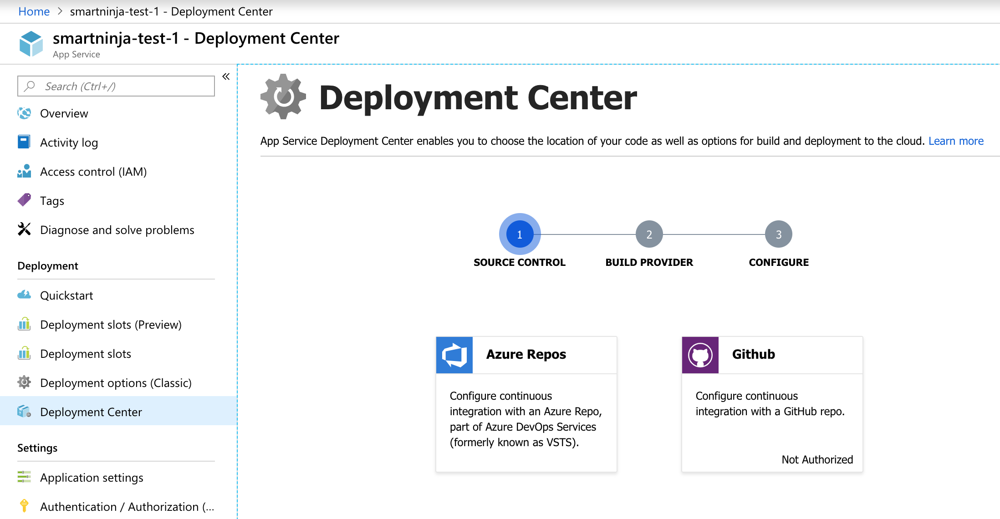

**Step 2:** Select App Service Kudu Build Service.

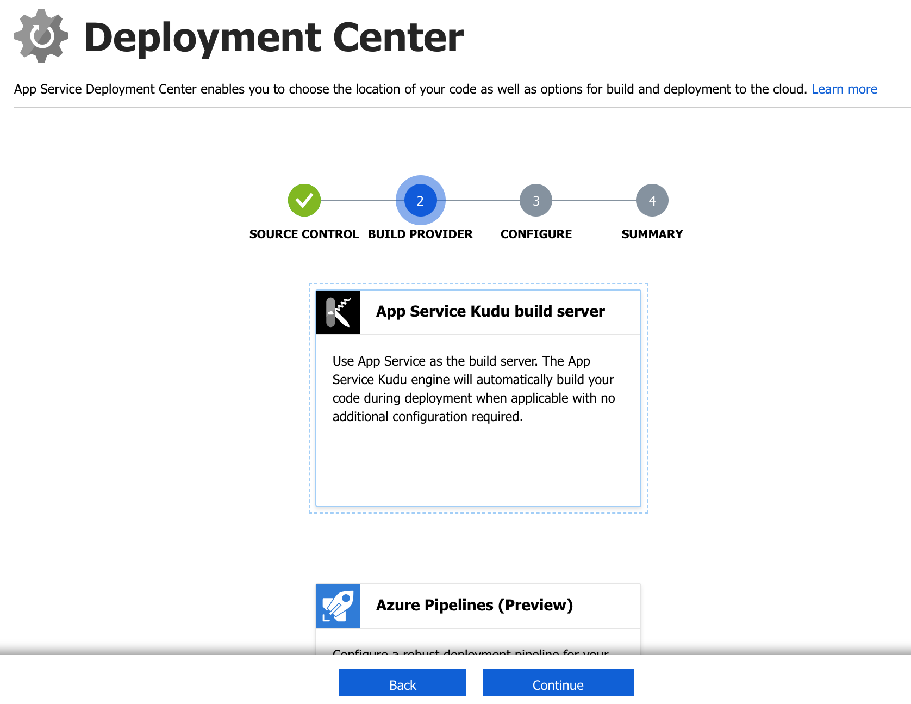

**Step 3:** Choose your Flask repository.

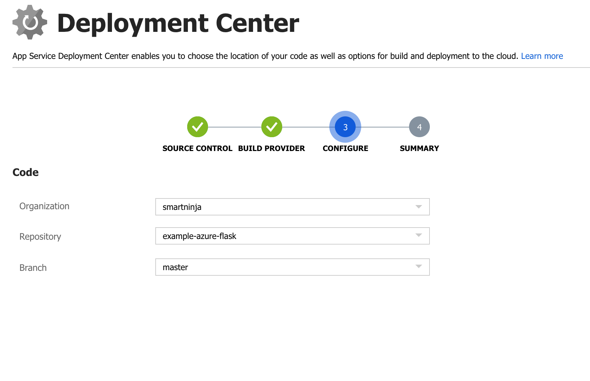

**Step 4:**

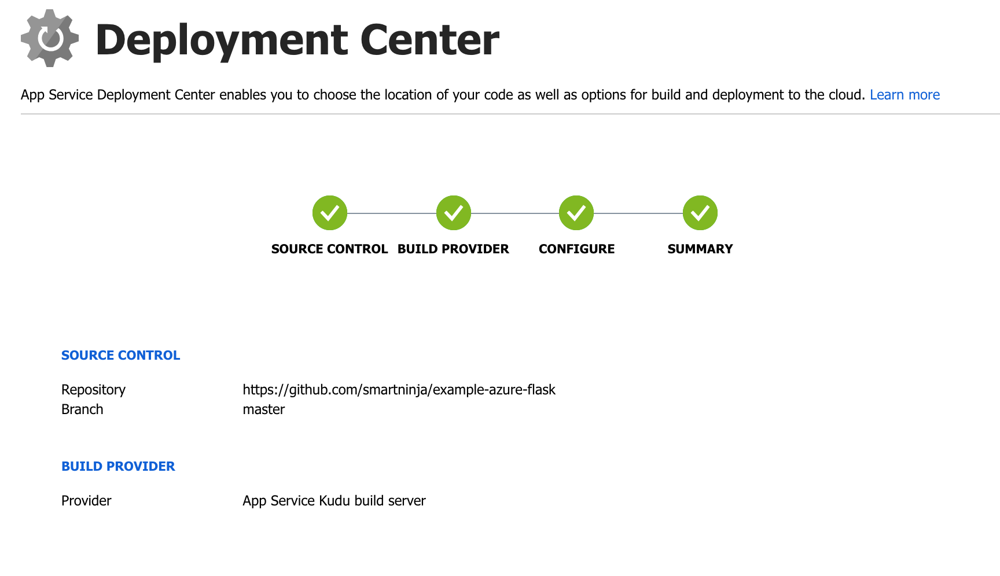

**Step 5:** Your GitHub code has been deployed to Azure

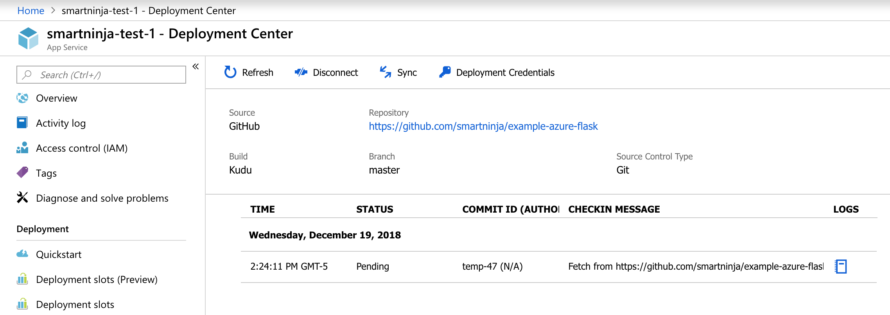

### One last thing

Since your Python file in your Flask project is named main.py, Azure does not recognize it automatically. If you would 
name it application.py, you wouldn't need to do this last step.

So the last step is to go to the **Application settings** and add the following line into the Startup file input box:

    gunicorn --bind=0.0.0.0 --timeout 600 main:app

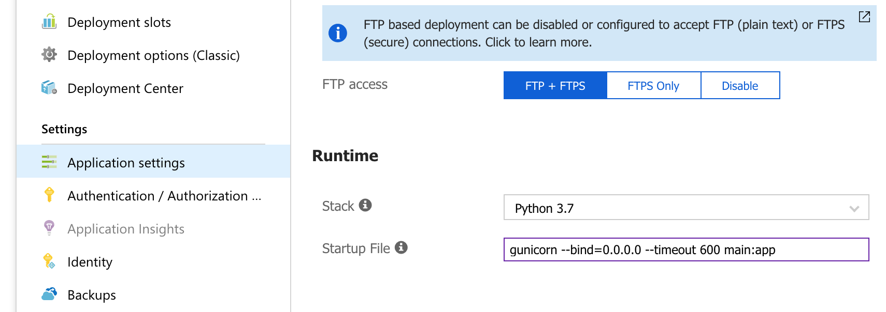

Now go check your webiste URL (you'll probably need to refresh it a couple of times). It should show the 
"Hello, SmartNinja!" text.
"# azure-flask-test" 
